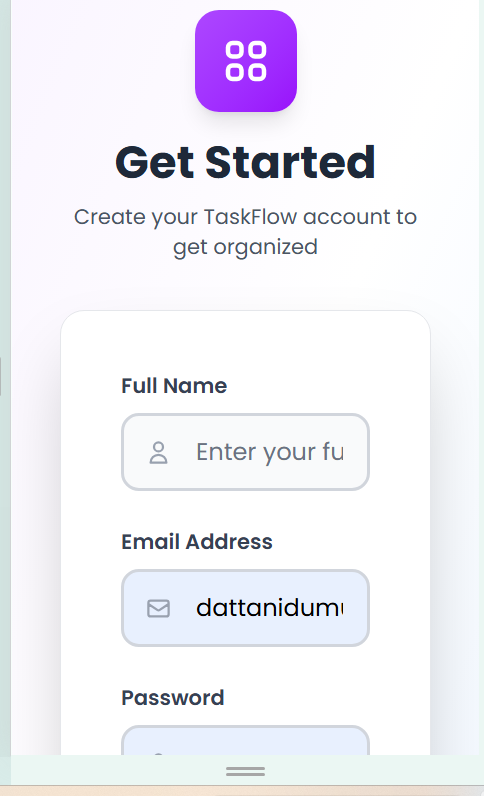
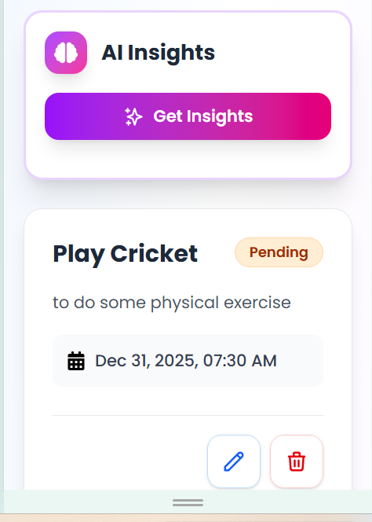
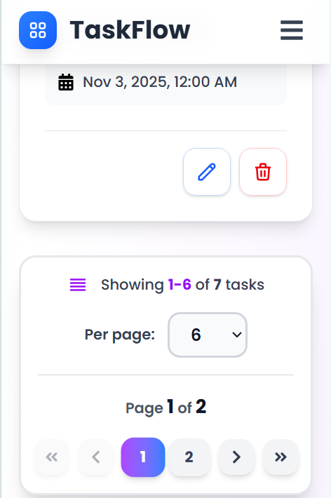

# Zylentrix TaskFlow - Enterprise Task Manager

A professional, enterprise-grade task management application built with React, Redux Toolkit, and Tailwind CSS, featuring a beautiful modern UI and seamless integration with the Zylentrix backend API.

## Features

- 🔐 **Secure Authentication**: JWT-based login/signup with protected routes
- 📋 **Complete Task Management**: Full CRUD operations with real-time updates
- 🤖 **AI-Powered Insights**: Get personalized productivity recommendations using Google Gemini
- 🎨 **Dark Mode Toggle**: Seamless light/dark theme switching
- 📊 **Dashboard Analytics**: Task statistics with visual cards
- 🔍 **Advanced Filtering**: Filter by status (completed/pending) and deadline
- 📈 **Smart Sorting**: Sort by creation date or deadline
- 📄 **Pagination**: Efficient task navigation with customizable page sizes
- 💾 **Persistent Storage**: Auto-save authentication and preferences
- 📱 **Fully Responsive**: Mobile-first design that works on all devices
- ⚡ **Performance Optimized**: Redux Toolkit for efficient state management
- 🎯 **Enterprise UI**: Modern design with icons, animations, and professional aesthetics

## Screenshots

### Sign Up Page


### Dashboard Overview


### Task Management Modals


### AI-Powered Insights


### Pagination


## Tech Stack

- **React 19** - UI framework
- **Redux Toolkit** - State management
- **React Router** - Navigation
- **Axios** - HTTP client
- **Tailwind CSS** - Styling
- **React Icons** - Icon set
- **Google Gemini AI** - AI insights generation
- **Vite** - Build tool and dev server

## Setup

1. **Install dependencies**:
```bash
npm install
```

2. **Configure environment variables** (optional):
   - Create a `.env` file in the root directory
   - Add your Gemini API key (see [Environment Variables](#environment-variables) section below for details)

3. **Start the development server**:
```bash
npm run dev
```

4. **Open your browser** and navigate to `http://localhost:5173`

## Project Structure

```
zylentrex/
├── public/                 # Static assets
│   └── vite.svg           # Vite logo
├── src/
│   ├── assets/            # Image assets
│   │   └── react.svg     # React logo
│   ├── components/       # Reusable UI components
│   │   ├── AIInsights.jsx    # AI-powered task insights component
│   │   ├── Filters.jsx       # Task filtering component
│   │   ├── Pagination.jsx    # Pagination controls
│   │   ├── ProtectedRoute.jsx  # Route protection wrapper
│   │   ├── TaskList.jsx       # Task display component
│   │   └── TaskModal.jsx     # Task create/edit modal
│   ├── pages/            # Page components
│   │   ├── Dashboard.jsx # Main dashboard page
│   │   ├── Login.jsx     # Login page
│   │   └── Signup.jsx    # Signup page
│   ├── services/         # API service layer
│   │   ├── aiService.js  # Google Gemini AI service
│   │   └── api.js        # Axios configuration and API calls
│   ├── store/           # Redux store configuration
│   │   ├── slices/      # Redux slices
│   │   │   ├── authSlice.js   # Authentication state
│   │   │   ├── tasksSlice.js  # Tasks state management
│   │   │   └── themeSlice.js # Dark/Light mode theme state
│   │   └── store.js     # Redux store configuration
│   ├── App.css          # App-specific styles
│   ├── App.jsx          # Main app component & routing
│   ├── index.css        # Global styles & Tailwind imports
│   └── main.jsx         # Application entry point
├── .gitignore          # Git ignore rules
├── eslint.config.js    # ESLint configuration
├── index.html          # HTML template
├── package.json        # Dependencies and scripts
├── tailwind.config.js  # Tailwind CSS configuration
├── vercel.json         # Vercel deployment configuration
└── vite.config.js      # Vite build configuration
```

## Backend API

The frontend connects to the Zylentrix backend API:
- Base URL: `https://zylentrix-backend.onrender.com`
- Authentication: JWT Bearer token
- Endpoints: Login, Signup, Tasks CRUD

## Usage

1. **Sign Up**: Create a new account
2. **Login**: Access your dashboard
3. **Create Tasks**: Click "Add Task" to create new tasks
4. **Edit Tasks**: Click the edit icon on any task card
5. **Delete Tasks**: Click the delete icon on any task card
6. **Filter**: Use the filter dropdowns to find specific tasks
7. **Sort**: Click on sort buttons to organize tasks
8. **Toggle Dark Mode**: Click the moon/sun icon in the navbar
9. **Logout**: Click the logout icon to sign out

